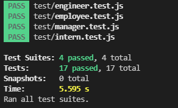
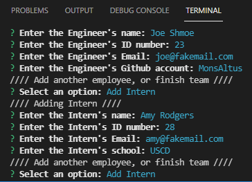
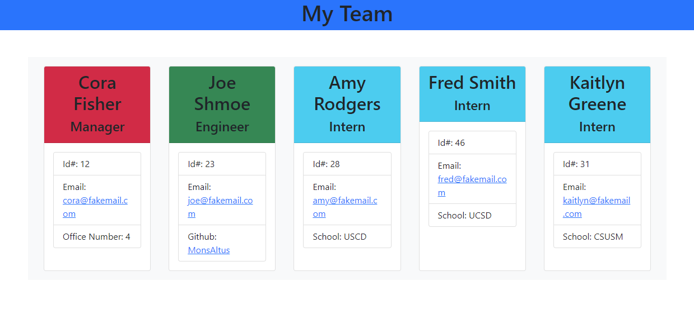

# Team-Profile-Generator
## A Team Profile Generator using Node.js and Inquirer

## Description:
This application creates a HTML page to display various information about a team based on user input through Inquirer.
The page is styled through Bootstrap and includes card elements displaying employee data for a Manager, Engineers, and Interns.
Employee information includes Name, Id number, and Email, as well as office number for Managers, Github profiles for Engineers, and school of study for Interns.

## Table of Contents:
[User Story](#User-Story) 
[Installation](#Installation) 
[Usage](#Usage) 
[Tests](#Tests) 
[Contributions](#Contributions) 
[Contact](#Contact) 
[License](#License) 

## User Story:
- AS A manager
- I WANT to generate a webpage that displays my team's basic info
- SO THAT I have quick access to their emails and GitHub profiles

## Installation:
Install dependencies by running `npm i` in your terminal in the root folder.

## Usage:
Once installed, enter `node index.js` into your terminal in the root folder of the application. Answer the following prompts. 
[Video of the tests and app running in VSCode](https://drive.google.com/file/d/1wUHj8n3GcWNp_x_zlvDgCMx_R1MaHL_L/view) 
 
 
 

## Tests:
Tests included to check input for the employee classes. 
Run `npm test` in the root folder.

## Contributions:
Technologies used include JavaScript, Node.js, Inquirer, and Jest.

## Contact:
Check out my [Github](https://github.com/MonsAltus). 
Email me at <hacklander.dev@gmail.com>

## License:
Covered under the [MIT License](https://github.com/MonsAltus/Team-Profile-Generator/blob/main/LICENSE).
